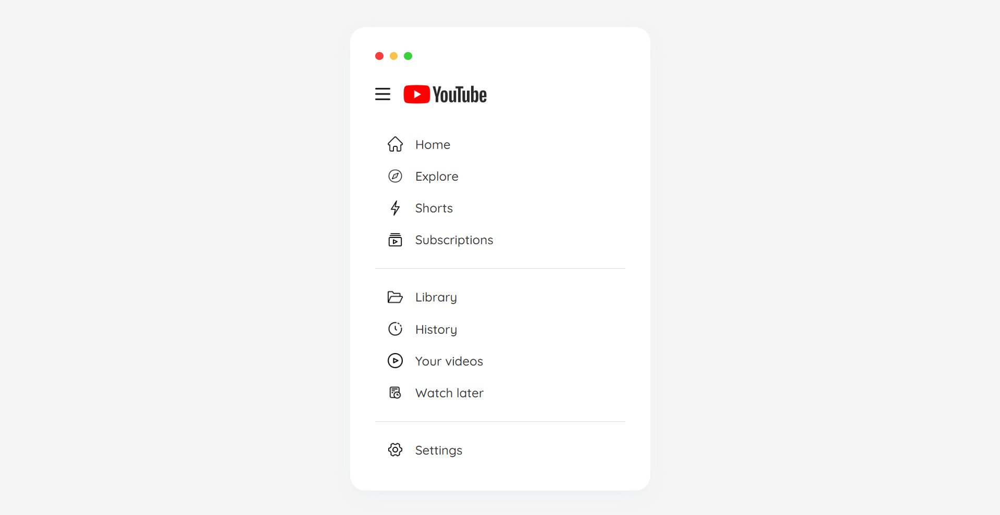
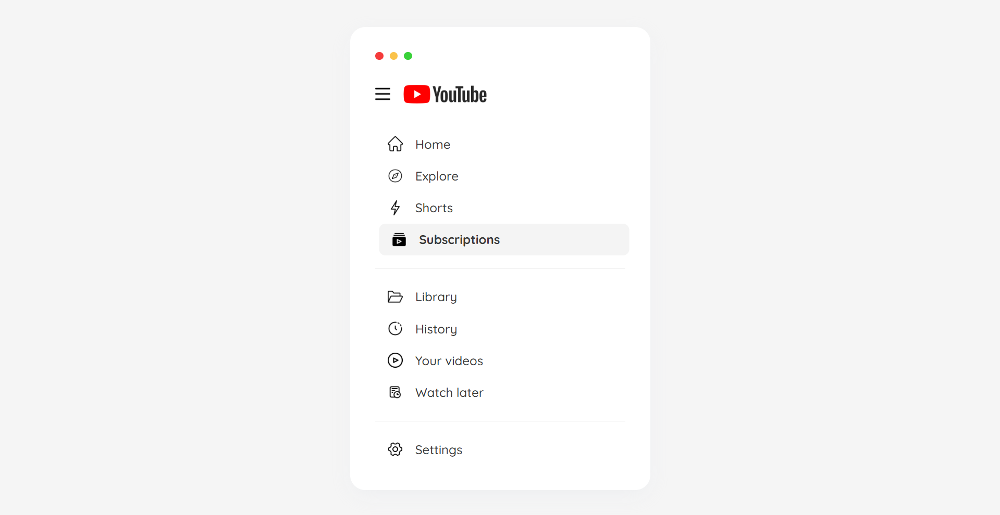

# YouTube Style Navbar

## Project Overview

### Description

A responsive YouTube-style sidebar navigation with interactive icons and hover effects, designed to adapt to various screen sizes for an optimal user experience.

➡️[Live Link](https://youtube-style-navbar.vercel.app/)

### Screenshots

### Technologies Used
- **HTML** – Structured the layout with sections for navigation icons, logo, and links.
- **CSS** – Styled the sidebar, navigation items, and responsive design using media queries.
- **JavaScript** – Implemented interactivity by highlighting the active navigation item upon click.

### Learnings & Outcome
- Created a fully responsive sidebar that adapts to mobile, tablet, and desktop screen sizes.
- Gained experience in handling icon states, hover effects, and active item highlighting using CSS transitions.
- Improved skills in designing clean and visually appealing navigation bars with interactive features.

### Connect with Me

Stay connected and explore more of my work:

Thanks for diving into this project! Let's create something amazing together. **Happy coding!** 🚀
